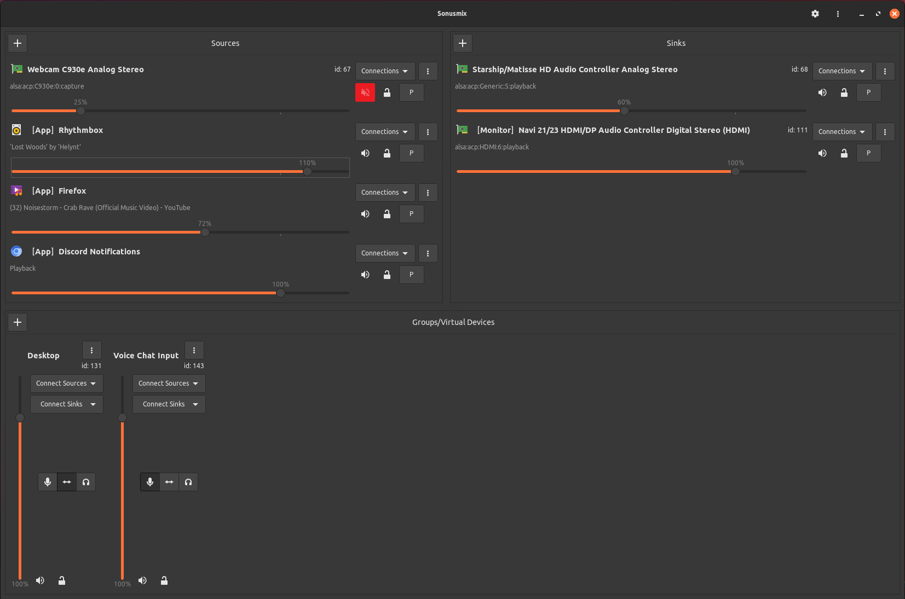

# Sonusmix

[](https://ci.codeberg.org/repos/13704) [](https://matrix.to/#/#sonusmix:matrix.org) [](https://github.com/sonusmix/sonusmix)

### \[[Installation](#installation)\] \[[Building From Source](#building-from-source)\]

A tool to easily route and manage audio devices in Pipewire. It intends to enable the same features and workflows as [Voicemeeter](https://vb-audio.com/Voicemeeter/) or [Pulsemeeter](https://github.com/theRealCarneiro/pulsemeeter), but with a more intuitive interface, and while making it as easy as possible to combine with other Pipewire audio apps.


The screenshot below was taken using the `Mint-Y-Dark-Orange` GTK theme and the `Papirus` icon theme, but the app should change to match your configured GTK and icon theme.



## Features

### Virtual Devices (Group Nodes)
Sonusmix allows you to easily create virtual devices that you can select as inputs or outputs in other programs, and route audio between them

### App Endpoints
Many apps play audio through separate nodes, which normally would need to be controlled individually. Sonusmix gives you the option to manage all the audio from an app at once.

### Configuration Locking
Sonusmix allows you to lock settings such as connections and volume so that if they are ever changed outside of Sonusmix, they will will be automatically restored.

### Persistence
Sonusmix will save your configuration and load it again when it starts up. (Note: this currently works for group nodes and app endpoints. Sonusmix will make a best-effort attempt to restore everything else, too, but it may not always work. We plan to improve this in the future.)

### Volume Control
Control the volume of any app or device individually, similar to `pavucontrol`.

## Planned Features

### Channel Maps
Currently Sonusmix is only expected to work with "standard" stereo devices. However, in the future we plan to allow you to create custom channel layouts for "non-standard" devices such as those using the pro-audio mode or JACK-style devices such as [`jack_mixer`](https://github.com/jack-mixer/jack_mixer).

### Audio plugins
If you use audio plugins such as [easyeffects](https://github.com/wwmm/easyeffects), you can manage them in Sonusmix by adding them as normal endpoints. In the future we hope to build a more specialized way to interact with these kinds of plugins, and maybe add dedicated support for some specific filters such as noise cancellation.

### Patchbay View
If there is interest, we may implement a patchbay view to make it easier to see what connections are going where.

## Installation

### Flatpak
We currently host our own Flatpak repo, but plan to submit Sonusmix to Flathub in the future. To install, add the repository:
```bash
flatpak remote-add --if-not-exists sonusmix.org https://flatpak.sonusmix.org/sonusmix.org.flatpakrepo
flatpak install sonusmix.org org.sonusmix.Sonusmix
```
Or, install the flatpak directly:
```bash
flatpak install https://flatpak.sonusmix.org/Sonusmix.flatpakref
```
You can also build from source, as described below.

### Flatpak and GTK Themes
Unfortunately, Flatpak makes it difficult for apps to match your system theme. If you have issues, here are some troubleshooting steps to try:
- If you have Sonusmix installed as system, try installing it as a user instead (run the flatpak commands above with `--user`), and vice versa. You can see how it's currently installed by running `flatpak list`.
- Sonusmix is built in GTK4, which not all GTK themes support. You can check if a theme supports it by running `ls /usr/share/themes/<theme>` (or another folder where your theme might be). If there is a folder named `gtk-4<something>`, it should support GTK4.
- Flatpaks are sandboxed, and by default they can't read the themes on your system. Unfortunately, most system package managers install themes to `/usr/share/themes`, and Flatpak doesn't allow giving apps access inside `/usr/share`. Instead, there are two other directories which GTK searches for themes: `~/.themes` and `~/.local/share/themes`. Copy the theme you want to use from `/usr/share/themes` into both of these locations, creating them if they don't already exist:
```bash
mkdir -p ~/.themes ~/.local/share/themes
cp -r /usr/share/<theme> ~/.themes/
cp -r /usr/share/<theme> ~/.local/share/themes
```
Then, give Sonusmix access to these directories (you may have to use `sudo`):
```bash
flatpak override org.sonusmix.Sonusmix --filesystem="$HOME/.themes"
flatpak override org.sonusmix.Sonusmix --filesystem="$HOME/.local/share/themes"
```
Or, you can do this for all of your installed Flatpak apps (again, `sudo` may be required):
```bash
flatpak override --filesystem="$HOME/.themes"
flatpak override --filesystem="$HOME/.local/share/themes"
```
You can also use an application such as [Flatseal](https://flathub.org/apps/com.github.tchx84.Flatseal) for this.
- Finally, GTK may not be able to read what theme it should be using. On wayland, this depends on `xdg-desktop-portal-gtk`. You can make sure it's running with `systemctl --user status xdg-desktop-portal-gtk`. You can also manually set the GTK theme using an environment variable (again, `sudo` may be required):
```bash
flatpak override org.sonusmix.Sonusmix --env="GTK_THEME=<theme>" # For Sonusmix only
flatpak override --env="GTK_THEME=<theme>" # For all Flatpak apps
```

### AppImage
You can find AppImage builds [here](https://codeberg.org/sonusmix/sonusmix/releases). Please open an issue if you have any issues with the AppImages. You can also build from source, as described below.

## Building From Source
You can build the project with Nix, or install the dependencies manually:
- Rust and `cargo`
- `pipewire`
- `gtk4`
- `cargo-make` (from your system package manager or `cargo install --locked cargo-make`)
- `cargo-about` (from your system package manager or `cargo install --locked cargo-about`)
- `resvg` (from your system package manager or `cargo install --locked resvg`)
- `pax-utils` (only if building an AppImage)
- `appimagetool` (only if building an AppImage, though this will be automatically downloaded if needed as long as `wget` is installed)
- `flatpak` and `flatpak-builder` (only if building a Flatpak)

To build an AppImage after installing the dependencies, run:
```bash
git clone https://codeberg.org/sonusmix/sonusmix
cd sonusmix
cargo make build-appimage
```

Or, to build an AppImage using nix (without needing to install any other dependencies), run:
```bash
git clone https://codeberg.org/sonusmix/sonusmix
cd sonusmix
nix-shell shell.nix --pure --command "cargo make build-appimage"
```

Building a Flatpak is possible, but does not work under nix. You will have to install the dependencies above, and then run:
```bash
git clone https://codeberg.org/sonusmix/sonusmix
cd sonusmix
cargo make install-flatpak # or cargo make build-flatpak to build without installing
```

## Support & Feedback
Sonusmix has a Matrix chatroom at [#sonusmix:matrix.org](https://matrix.to/#/#sonusmix:matrix.org). If you have any issues or feedback, please drop in and we will be happy to help you out!

## License

Sonusmix uses the [Mozilla Public License Version 2.0](https://www.tldrlegal.com/license/mozilla-public-license-2-0-mpl-2). You can find the license file here: [LICENSE](LICENSE).
