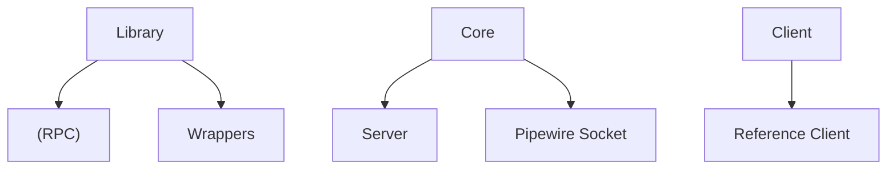

## Project Structure

---

The project is broken into three parts:

- A library containing code common to all parts (such as serialization and deserialization, and maybe RPC)
- A "core" binary containing the pulsemeeter server, AKA the parts that interact with the audio server
- A "client" binary containing the reference client

