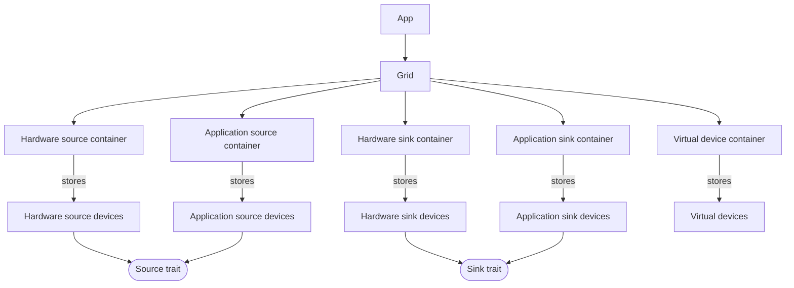

# Frontend

This is the Sonusmix frontend using [Iced](https://github.com/iced-rs/iced).

## Structure

```mermaid
flowchart TD
    App --> Grid
    Grid --> HardwareSourceContainer[Hardware source container]
    Grid --> ApplicationSourceContainer[Application source container]
    Grid --> HardwareSinkContainer[Hardware sink container]
    Grid --> ApplicationSinkContainer[Application sink container]
    Grid --> VirtualDeviceContainer[Virtual device container]

    HardwareSourceContainer -->|stores| HardwareSourceDevice[Hardware source devices]
    ApplicationSourceContainer -->|stores| ApplicationSourceDevice[Application source devices]
    HardwareSinkContainer -->|stores| HardwareSinkDevice[Hardware sink devices]
    ApplicationSinkContainer -->|stores| ApplicationSinkDevice[Application sink devices]
    VirtualDeviceContainer -->|stores| VirtualDevice[Virtual devices]

    HardwareSourceDevice --> SourceTrait([Source trait])
    ApplicationSourceDevice --> SourceTrait

    HardwareSinkDevice --> SinkTrait([Sink trait])
    ApplicationSinkDevice --> SinkTrait
```